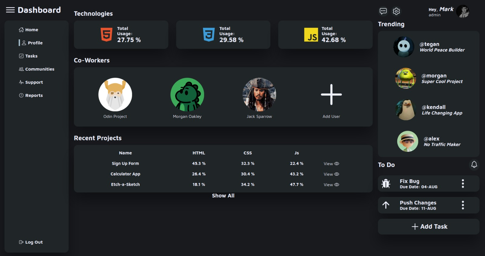
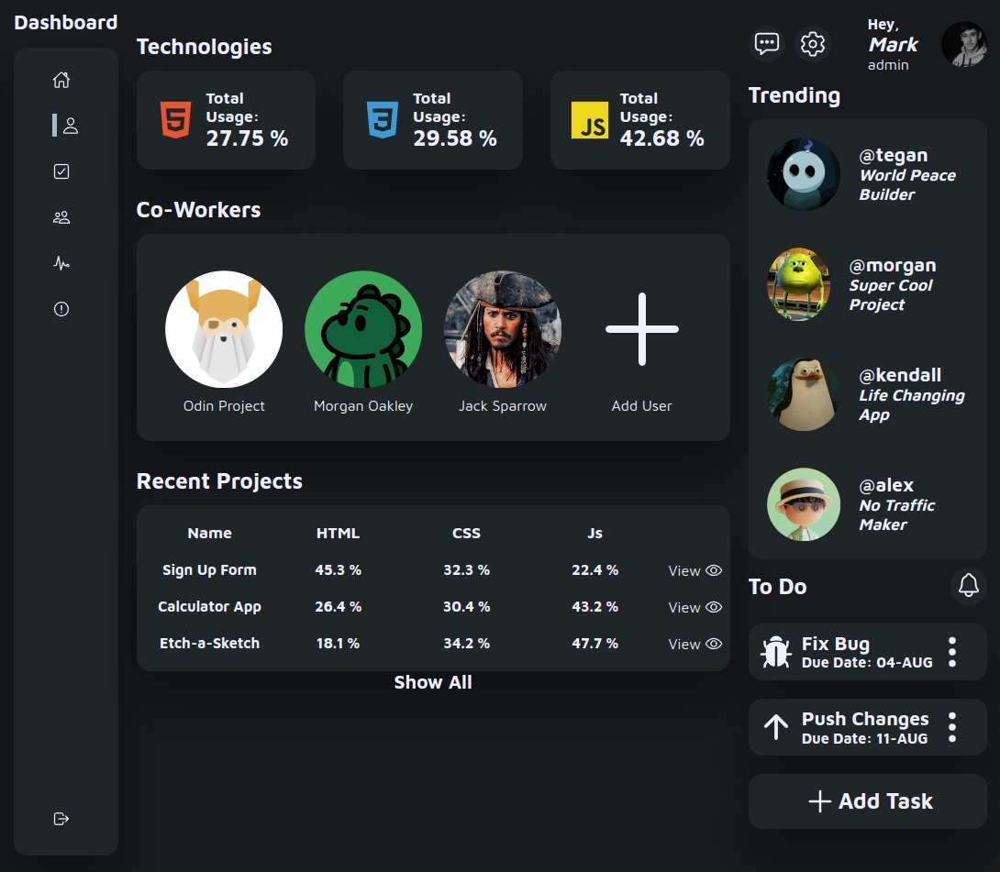
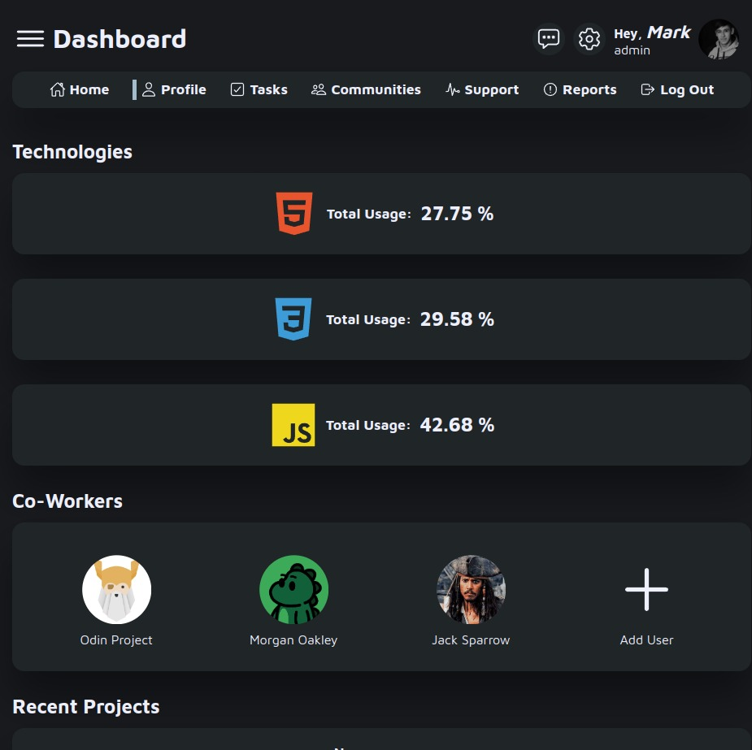
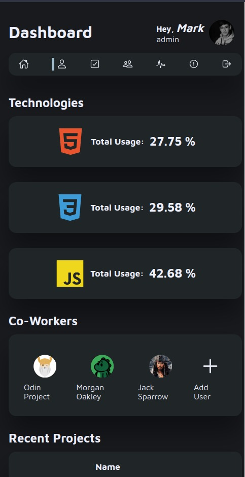

# admin-dashboard

   
   
   
  

# Learnings

- Used grid to make most of the layout.
- Learned new ways to use grid.
- Used for the first time more tha one media query to make the layout responsive.

[Live Preview](https://raulurdanetag.github.io/admin-dashboard/) 👈
